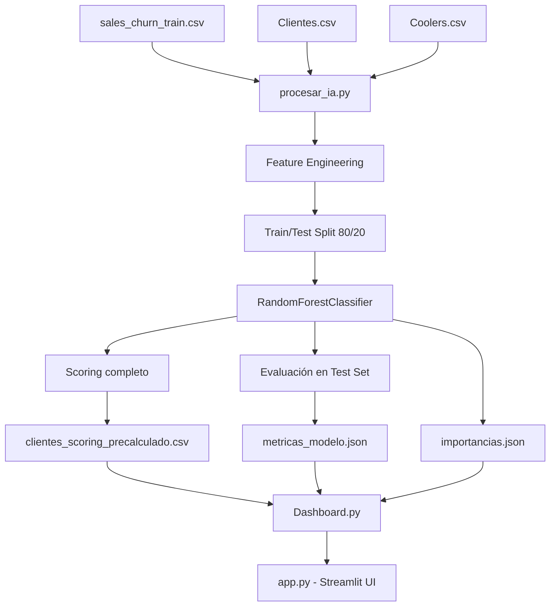

# Churn Hunters — Plataforma de Retención y Análisis de Clientes

> **Sistema de Inteligencia de Retención para Distribuidoras de Bebidas**  
> Hackathon 2026 · Distribuidora Coca-Cola

---

## 1. Descripción General del Proyecto

### Objetivo Principal

Churn Hunters es una plataforma web multipágina que predice y visualiza el **riesgo de abandono (churn) de tiendas clientes** de una distribuidora de bebidas (Coca-Cola). El sistema utiliza Machine Learning para asignar a cada tienda un **porcentaje de probabilidad de abandono**, permitiendo al equipo comercial priorizar acciones de retención antes de que la pérdida ocurra.

### Problema que Resuelve

Las distribuidoras pierden clientes (tiendas, puntos de venta) sin poder anticiparlo. El abandono impacta directamente en:

- Volumen de cajas vendidas
- Ingresos recurrentes por zona y canal
- Eficiencia del equipo de ventas

Sin datos procesados, los representantes comerciales no saben **qué tiendas están en riesgo** ni **por qué**. Churn Hunters cierra esa brecha.

### Usuarios Objetivo

- **Equipos comerciales y de ventas** de distribuidoras de bebidas
- **Gerentes de territorio y zona** que necesitan visibilidad sobre clientes en riesgo
- **Analistas de datos y científicos de datos** que mantienen el modelo de ML
- Compatible con cualquier distribuidora que maneje datos transaccionales por cliente

---

## 2. Arquitectura del Sistema

### Componentes Principales

El sistema está organizado en **tres capas independientes**:

| Capa | Archivo | Responsabilidad |
|------|---------|-----------------|
| **Pipeline de ML** | `procesar_ia.py` | Entrena el modelo, genera scores y persiste resultados en disco |
| **Dashboard Analítico** | `pages/Dashboard.py` | Visualiza los resultados del modelo con gráficos interactivos |
| **App Principal** | `app.py` | Punto de entrada Streamlit, enruta a las páginas |

### Flujo de Datos

```
┌─────────────────────────────────────────────────────────────────┐
│                     FUENTES DE DATOS RAW                        │
│   sales_churn_train.csv  │  Clientes.csv  │  Coolers.csv        │
└────────────────┬────────────────────────────────────────────────┘
                 │
                 ▼
┌─────────────────────────────────────────────────────────────────┐
│                   procesar_ia.py                                 │
│  1. Feature Engineering (agregaciones por cliente)              │
│  2. Merge de tablas (transacciones + clientes + coolers)         │
│  3. Train / Test Split (80% / 20%)                              │
│  4. Entrenamiento RandomForestClassifier                         │
│  5. Evaluación (AUC-ROC, Precisión, Recall, F1)                 │
│  6. Scoring de TODOS los clientes                               │
└────────────────┬────────────────────────────────────────────────┘
                 │  Genera 3 archivos en /data/
                 ▼
┌──────────────────────────────────────────────────────────────────┐
│  clientes_scoring_precalculado.csv  │  importancias.json         │
│  metricas_modelo.json                                            │
└────────────────┬─────────────────────────────────────────────────┘
                 │
                 ▼
┌─────────────────────────────────────────────────────────────────┐
│                  Dashboard.py (Streamlit)                        │
│  - Lee el CSV de scoring como única fuente de verdad            │
│  - Aplica filtros dinámicos (región, canal, tamaño, cooler)     │
│  - Renderiza KPIs, gráficos y métricas del modelo               │
└─────────────────────────────────────────────────────────────────┘
```

### Diagrama Mermaid



---

## 3. Tecnologías Utilizadas

### Lenguajes

- **Python 3.x** — lenguaje único del proyecto

### Frameworks

- **Streamlit** — framework web para la interfaz de usuario multipágina

### Librerías de Datos y ML

| Librería | Uso |
|----------|-----|
| `pandas` | Manipulación y agregación de datos tabulares |
| `scikit-learn` | `RandomForestClassifier`, `train_test_split`, métricas de evaluación |
| `plotly` (express + graph_objects) | Gráficos interactivos en el dashboard |

### Librerías Estándar

- `os` — manejo de rutas de archivos
- `json` — serialización de métricas e importancias

### Servicios Externos

- **MongoDB Atlas** — base de datos mencionada en `app.py` para la pestaña de Bases de Datos (módulo no incluido en los archivos analizados)
- **Google Fonts (DM Sans)** — tipografía cargada vía CDN en el Dashboard

> **Nota:** No se encontró un archivo `requirements.txt` entre los archivos proporcionados. Las dependencias se infieren del código fuente.

---

## 4. Instalación y Ejecución

### Requisitos Previos

- Python 3.8 o superior
- pip
- Git (opcional)

### Dependencias Inferidas

Instalar con:

```bash
pip install streamlit pandas scikit-learn plotly
```

> Si existe un `requirements.txt` en el repositorio completo, usar `pip install -r requirements.txt`.

### Variables de Entorno

No se detectaron variables de entorno explícitas en los archivos analizados. La conexión a MongoDB Atlas (módulo de base de datos) probablemente requiere credenciales; verificar en el módulo correspondiente (`pages/Bases_datos.py` o similar, no incluido en los archivos proporcionados).

### Estructura de Datos Requerida

Antes de ejecutar, crear la carpeta `data/` en la raíz del proyecto y colocar los siguientes archivos CSV:

```
data/
├── sales_churn_train.csv     # Historial de transacciones con columna target
├── Clientes.csv              # Información de clientes (territorio, canal, tamaño)
└── Coolers.csv               # Información de enfriadores por cliente
```

### Paso 1: Generar el Scoring con el Modelo de IA

```bash
python procesar_ia.py
```

Este comando entrena el modelo y genera en `data/`:
- `clientes_scoring_precalculado.csv`
- `importancias.json`
- `metricas_modelo.json`

### Paso 2: Levantar la Aplicación Web

```bash
streamlit run app.py
```

La aplicación estará disponible en `http://localhost:8501`.

---

## 5. Estructura de Carpetas

```
proyecto/
│
├── app.py                          # Página principal y punto de entrada de Streamlit
├── procesar_ia.py                  # Pipeline de ML: entrenamiento y scoring
├── .gitignore                      # Excluye datos sensibles y entorno virtual
│
├── pages/                          # Páginas adicionales de la app Streamlit
│   ├── Dashboard.py                # Dashboard de visualización (analítica + modelo)
│   ├── [Bases_datos.py]            # Conexión MongoDB Atlas (no incluido en análisis)
│   └── [Estrategia.py]             # Simulador de riesgo individual (no incluido)
│
└── data/                           # Carpeta de datos (excluida parcialmente del repo)
    ├── sales_churn_train.csv        # Excluida del repo (.gitignore)
    ├── Coolers.csv                  # Excluida del repo (.gitignore)
    ├── Clientes.csv                 # Input de clientes (no excluida explícitamente)
    ├── clientes_scoring_precalculado.csv  # Generada + excluida del repo
    ├── importancias.json            # Generada por procesar_ia.py
    └── metricas_modelo.json         # Generada por procesar_ia.py
```

> Los archivos en `data/` marcados con están listados en `.gitignore` y no se versionan en el repositorio.

---

## 6. Funcionamiento Interno

### Pipeline de Procesamiento (`procesar_ia.py`)

#### 6.1 Carga de Datos

```python
train    = pd.read_csv(path_train)    # Transacciones históricas con etiqueta churn
clientes = pd.read_csv(path_clientes) # Atributos estáticos de cada cliente
coolers  = pd.read_csv(path_coolers)  # Datos de infraestructura de frío
```

#### 6.2 Ingeniería de Features (Feature Engineering)

El sistema agrega los datos históricos de transacciones al nivel de **un registro por cliente**:

```python
cust = train.groupby("customer_id").agg(
    meses_activo        = ("calmonth",          "count"),
    total_transacciones = ("num_transacciones",  "sum"),
    avg_transacciones   = ("num_transacciones",  "mean"),
    avg_boxes           = ("uni_boxes_sold_m",   "mean"),
    total_boxes         = ("uni_boxes_sold_m",   "sum"),
    churned             = ("target",             "max"),
).reset_index()
```

Luego calcula un **ratio de tendencia** que compara la actividad reciente con la actividad temprana del cliente:

```python
early_mean = transacciones de los primeros 3 meses del cliente
late_mean  = transacciones de los últimos 3 meses del cliente
trend_ratio = late_mean / early_mean
```

Un `trend_ratio < 1` indica que el cliente compra menos recientemente que antes — señal de riesgo.

#### 6.3 Merge de Tablas

Se consolida información de las tres fuentes:
1. Features de transacciones (calculadas arriba)
2. Datos de coolers (promedio de enfriadores por cliente; si no cruza, se asigna `avg_coolers = 1`)
3. Atributos de clientes (`territory_id`, `comercial_subchannel_d`, `rtm_customer_size_d`, etc.)

**Decisión de negocio importante:** Por regla del modelo, se fuerza `tiene_cooler = 1` para todos los clientes de la muestra, asumiendo que todas las tiendas tienen infraestructura de frío activa.

#### 6.4 División Train/Test y Entrenamiento

```python
X_train, X_test, y_train, y_test = train_test_split(
    X, y, test_size=0.20, random_state=42, stratify=y
)
```

Se usa `stratify=y` para garantizar que ambos conjuntos tengan la misma proporción de clientes churned/activos.

#### 6.5 Dashboard (`Dashboard.py`)

- Lee `clientes_scoring_precalculado.csv` como **única fuente de verdad** (no recalcula features)
- Aplica filtros laterales dinámicos (región, canal, tamaño, cooler)
- Renderiza KPIs, distribuciones, evolución temporal y métricas del modelo

---

## 7. Explicación Exhaustiva del Porcentaje de Riesgo de Abandono

> Esta es la sección más importante. Explica con exactitud cómo se calcula el número que aparece como "probabilidad de churn" de cada tienda.

### 7.1 Origen de los Datos

El riesgo de abandono se calcula a partir de **tres fuentes de datos CSV**:

| Archivo | Información que aporta |
|---------|------------------------|
| `sales_churn_train.csv` | Historial mensual de transacciones, cajas vendidas y etiqueta de abandono (`target`) |
| `Clientes.csv` | Territorio, canal comercial, tamaño del cliente |
| `Coolers.csv` | Número de enfriadores asignados a cada cliente |

### 7.2 Variables (Features) que Intervienen

El modelo recibe exactamente **9 variables** para predecir el riesgo:

| Feature | Descripción | Cómo se calcula |
|---------|-------------|-----------------|
| `meses_activo` | Cuántos meses el cliente tuvo al menos una transacción | `count` de registros en el historial |
| `total_transacciones` | Suma total de transacciones en todo el período | `sum` de `num_transacciones` |
| `avg_transacciones` | Promedio mensual de transacciones | `mean` de `num_transacciones` |
| `avg_boxes` | Promedio mensual de cajas vendidas | `mean` de `uni_boxes_sold_m` |
| `total_boxes` | Total de cajas vendidas en todo el período | `sum` de `uni_boxes_sold_m` |
| `trend_ratio` | Tendencia de actividad reciente vs. temprana | `media últimos 3 meses / media primeros 3 meses` |
| `tiene_cooler` | Si el cliente tiene enfriador asignado | Forzado a `1` por regla de negocio |
| `avg_coolers` | Número promedio de enfriadores | `mean` de `num_coolers`; default `1` si no cruza |
| `territorio_encoded` | Codificación numérica del territorio | `category codes` de la columna de territorio detectada |

### 7.3 Transformación y Limpieza de Datos

Antes de alimentar el modelo:

1. **Valores nulos** → se reemplazan con `0` mediante `.fillna(0)`
2. **Territorio** → detección automática de la columna (busca columnas con `'territor'` o `'zona'` en el nombre); si no existe, asigna `territorio_encoded = 0`
3. **Trend ratio** → si `early_mean == 0` (cliente sin historial temprano), se asigna `1.0` para evitar división por cero
4. **Coolers sin cruce** → `avg_coolers = 1` por defecto; `tiene_cooler = 1` siempre (regla de negocio)
5. **Variable objetivo** → `churned = max(target)` por cliente; si el cliente tuvo `target = 1` en cualquier mes, se considera que hizo churn

### 7.4 Modelo de IA Utilizado: Random Forest Classifier

```python
modelo_rf = RandomForestClassifier(
    n_estimators=100,    # 100 árboles de decisión
    max_depth=8,         # Profundidad máxima de cada árbol
    class_weight="balanced",  # Compensa el desbalance entre churned y activos
    random_state=42      # Reproducibilidad
)
modelo_rf.fit(X_train, y_train)
```

**¿Qué es un Random Forest?**  
Es un conjunto (_ensemble_) de 100 árboles de decisión independientes. Cada árbol se entrena con una muestra aleatoria de datos y variables. Para predecir, cada árbol vota, y el modelo promedia las probabilidades de los 100 votos.

**¿Por qué `class_weight="balanced"`?**  
En datos de churn, los clientes que abandonan son minoría. Sin este parámetro, el modelo aprendería a predecir siempre "no churn" con alta precisión pero sin valor. `balanced` ajusta automáticamente los pesos para dar más importancia a los casos de churn.

### 7.5 Cómo se Genera la Predicción

El modelo genera **dos valores** por cada cliente:

- `predict(X)` → clasificación binaria (`0` = activo, `1` = churn)
- `predict_proba(X)[:, 1]` → **probabilidad de churn** (número entre 0.0 y 1.0)

El sistema usa exclusivamente el segundo:

```python
cust['probabilidad_churn'] = modelo_rf.predict_proba(X)[:, 1]
```

Esta columna es el **porcentaje de riesgo** que ve el usuario, multiplicado por 100.

### 7.6 Qué Significa Técnicamente el Porcentaje

El valor `probabilidad_churn = 0.73` significa:

> "Dado el historial de compras, tendencia, territorio y equipamiento de esta tienda, el modelo estima que existe un **73% de probabilidad** de que la tienda abandone (deje de comprar) en función de los patrones aprendidos durante el entrenamiento."

**Técnicamente:** es la proporción de los 100 árboles del Random Forest que clasificaron a ese cliente como churn. Si 73 de los 100 árboles votaron "churn", la probabilidad es 0.73.

### 7.7 Cómo se Obtiene Matemáticamente

```
probabilidad_churn = (número de árboles que votan "churn") / (total de árboles = 100)

Ejemplo:
  - 100 árboles en el bosque
  - 73 árboles predicen "churn = 1"
  - 27 árboles predicen "churn = 0"
  → probabilidad_churn = 73/100 = 0.73 → 73%
```

Cada árbol decide basándose en umbrales aprendidos de las 9 features. No existe un umbral de clasificación explícito en el código: el sistema guarda la probabilidad continua, no la clasificación binaria.

### 7.8 Factores que Aumentan o Disminuyen el Riesgo

**Aumentan el riesgo (mayor probabilidad de churn):**

| Factor | Señal de riesgo |
|--------|-----------------|
| `avg_transacciones` bajo | Cliente compra poco frecuentemente |
| `trend_ratio` < 1 | La actividad del cliente está decayendo |
| `meses_activo` bajo | Cliente con poca historia o reciente |
| `total_boxes` bajo | Volumen acumulado pequeño |
| `territorio_encoded` | Algunos territorios históricamente con más churn |

**Disminuyen el riesgo:**

| Factor | Señal de fidelidad |
|--------|--------------------|
| `trend_ratio` > 1 | El cliente compra más hoy que al inicio |
| `avg_transacciones` alto | Alta frecuencia de pedidos |
| `total_boxes` alto | Gran volumen acumulado |
| `meses_activo` alto | Relación larga y sostenida |

> La importancia relativa exacta de cada variable se guarda en `data/importancias.json` y se visualiza en el Dashboard bajo la sección "Importancia de Variables".

### 7.9 Ejemplo Práctico

Supongamos dos tiendas:

**Tienda A — Riesgo Alto (~80%)**
```
meses_activo        = 4      (cliente reciente)
avg_transacciones   = 12     (baja frecuencia)
trend_ratio         = 0.4    (compra 60% menos que al inicio)
total_boxes         = 180
territorio_encoded  = 3      (zona con historial de churn)
```
→ El modelo detecta decrecimiento fuerte y poca antigüedad: alta probabilidad de churn.

**Tienda B — Riesgo Bajo (~15%)**
```
meses_activo        = 24     (cliente fidelizado)
avg_transacciones   = 85     (alta frecuencia)
trend_ratio         = 1.2    (compra más que al inicio)
total_boxes         = 4800
territorio_encoded  = 1      (zona estable)
```
→ El modelo detecta crecimiento y larga relación: baja probabilidad de churn.

### 7.10 Evaluación del Modelo

El sistema evalúa el modelo sobre el **20% de datos que no vio durante el entrenamiento**:

```
AUC-ROC   → qué tan bien separa churned de activos (1.0 = perfecto)
Precisión → de los que predice como churn, ¿qué % realmente lo son?
Recall    → de los que realmente hacen churn, ¿qué % detecta el modelo?
F1-Score  → balance armónico entre precisión y recall
```

Estas métricas se guardan en `data/metricas_modelo.json` y se visualizan en el Dashboard junto con la Curva ROC.

---

## 8. API

Este proyecto **no expone una API REST**. La interfaz es exclusivamente la aplicación web Streamlit. La comunicación entre el pipeline de ML y el frontend ocurre mediante archivos CSV y JSON en disco.

Si se requiriera una API en el futuro, los endpoints naturales serían:

| Endpoint sugerido | Descripción |
|-------------------|-------------|
| `GET /score/{customer_id}` | Probabilidad de churn de un cliente |
| `GET /scores` | Lista completa de scores con filtros |
| `POST /retrain` | Disparar re-entrenamiento del modelo |
| `GET /metrics` | Métricas del modelo actual |

---

## 9. Base de Datos

### MongoDB Atlas (Módulo Externo)

El archivo `app.py` menciona una página de "Bases de datos (ivana)" con conexión a **MongoDB Atlas**, pero ese módulo no fue incluido en los archivos analizados. No es posible documentar el esquema sin acceso al código correspondiente.

### Archivos CSV (Fuente de Datos del Modelo)

| Archivo | Columnas Detectadas | Descripción |
|---------|---------------------|-------------|
| `sales_churn_train.csv` | `customer_id`, `calmonth`, `num_transacciones`, `uni_boxes_sold_m`, `target` | Historial transaccional mensual. `calmonth` en formato `YYYYMM`. `target = 1` indica que ese mes el cliente hizo churn. |
| `Clientes.csv` | `customer_id`, `territory_d`, `comercial_subchannel_d`, `rtm_customer_size_d` + otros | Atributos estáticos del cliente: territorio, canal, tamaño |
| `Coolers.csv` | `customer_id`, `num_coolers` | Número de enfriadores activos por cliente |

### Archivo de Scoring Generado

`clientes_scoring_precalculado.csv` contiene todas las columnas de `Clientes.csv` más:

| Columna | Tipo | Descripción |
|---------|------|-------------|
| `probabilidad_churn` | float (0.0–1.0) | Score de riesgo predicho por el modelo |
| `churned` | int (0/1) | Etiqueta real de churn del conjunto de entrenamiento |
| `meses_activo` | int | Meses con actividad registrada |
| `total_transacciones` | float | Suma de transacciones históricas |
| `avg_transacciones` | float | Promedio mensual de transacciones |
| `avg_boxes` | float | Promedio mensual de cajas |
| `total_boxes` | float | Total de cajas históricas |
| `trend_ratio` | float | Ratio actividad reciente/temprana |
| `tiene_cooler` | int (siempre 1) | Indicador de infraestructura de frío |
| `avg_coolers` | float | Promedio de enfriadores |
| `territorio_encoded` | int | Código numérico del territorio |

---

## 10. Posibles Mejoras

### Mejoras Técnicas

- **Separar pipeline de predicción del de entrenamiento:** Crear un script `predict.py` separado que cargue el modelo serializado (joblib/pickle) sin reentrenar cada vez.
- **Serializar el modelo:** Guardar el `RandomForestClassifier` entrenado en disco para no repetir el entrenamiento en cada ejecución del dashboard.
- **Manejo de errores robusto:** Agregar validación de esquemas de los CSV de entrada para detectar columnas faltantes antes de fallar en tiempo de ejecución.
- **Logging estructurado:** Reemplazar los `print()` por el módulo `logging` de Python para control de niveles (DEBUG, INFO, WARNING, ERROR).
- **Archivo `requirements.txt`:** Generar y versionar dependencias exactas con `pip freeze > requirements.txt`.

### Mejoras en IA

- **Hiperparametrización:** Usar `GridSearchCV` o `Optuna` para optimizar `n_estimators`, `max_depth`, `min_samples_leaf`, etc.
- **Features adicionales:** Incorporar estacionalidad (mes del año), días desde la última compra (recency), y varianza de transacciones mensuales.
- **Modelos alternativos:** Evaluar `XGBoost` o `LightGBM`, que suelen superar a Random Forest en datos tabulares con clases desbalanceadas.
- **Explicabilidad por cliente:** Integrar SHAP values para mostrar en el dashboard **por qué** una tienda específica tiene ese score, no solo cuánto.
- **Reentrenamiento automático:** Disparar el pipeline automáticamente cuando llegan datos nuevos (cron job o trigger de MongoDB).
- **Validación cruzada:** Reemplazar el split único (80/20) por K-Fold estratificado para métricas más robustas.

### Mejoras de Rendimiento

- **Caché del modelo serializado:** Evitar reentrenar el modelo cada vez que se ejecuta `procesar_ia.py`; solo reentrenar cuando los datos cambian.
- **Optimización de carga en Dashboard:** El `@st.cache_data` ya aplica caché, pero con datasets grandes sería recomendable usar Parquet en lugar de CSV para cargas más rápidas.
- **Paginación en tablas:** Si el número de clientes crece, las tablas del dashboard pueden volverse lentas; implementar paginación o carga lazy.
- **Base de datos para scoring:** Mover el scoring a MongoDB Atlas (ya en uso) para evitar archivos CSV en disco y habilitar consultas en tiempo real.

---

## Equipo

| Módulo | Responsable |
|--------|-------------|
| Base de datos / MongoDB | Ivana |
| Dashboard / Visualización | Sofi |
| Estrategia / Simulador de riesgo | Charbel |
| Pipeline de IA | (inferido del código) |

---

*README generado a partir del análisis completo de los archivos: `app.py`, `Dashboard.py`, `procesar_ia.py`, `.gitignore`.*
